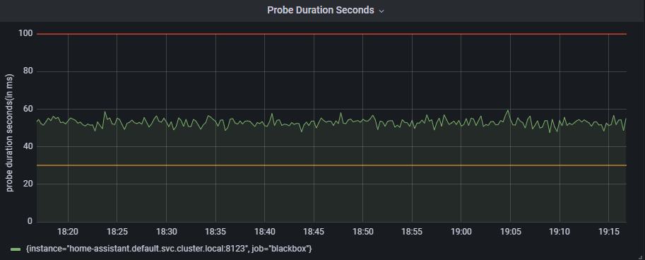
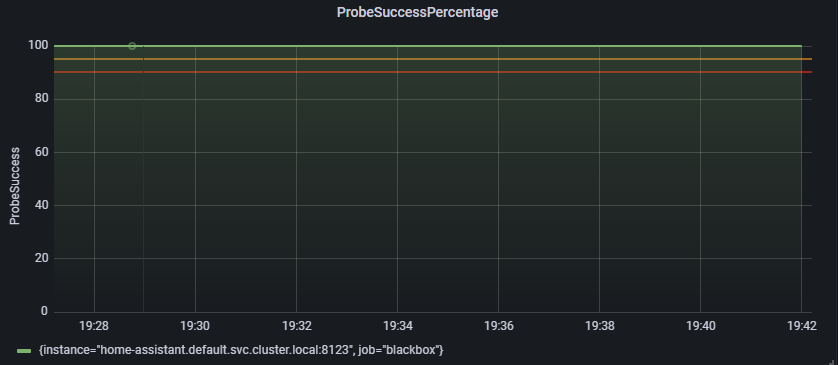
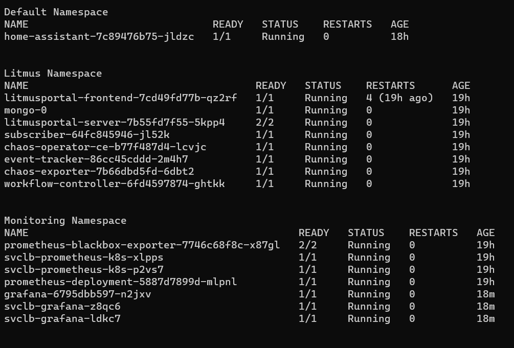

# Installing and Running Chaos on Raspberry Pis

## Installation Steps

1. Install Cluster
2. Install LitmusChaos
3. Login to Chaos Center
4. Install Home Assistant Application
5. Create Monitoring namespace
6. Install Blackbox Exporter
7. Install Prometheus Scraper
8. Install Grafana

## Detailed Steps

### Install Cluster
To install the cluster, edit the `cluster_install.sh` script with your values and run it

```
export SERVER_IP=x.x.x.x #Change this to the IP of the master node
export AGENT_IP=x.x.x.x #Change this to the IP of the agent node
export SERVER_USER=user #Change this to the user name of the master node
export AGENT_USER=user  #Change this to the user name of the agent node
```

After updating the values run
```
bash cluster_install.sh
```

<strong>Note 1:</strong> If you want to install more than one agent node, check the `cluster_install.sh` script for instructions to install for more than one agents


### Install LitmusChaos
To install LitmusChaos, apply the litmus manifest
```
kubectl apply -f litmus-2.5.0.yaml
```

### Login to Chaos Center
To login to Chaos Center, first get the port of the litmus frontend service
```
kubectl get svc -n litmus
```
Then access the Chaos Center using the port and your Raspberry Pi IP \
`https://<IP>:<port>`

<strong>Note</strong>: The default credentials are
```
Username: admin
Password: litmus 
```

### Install Home Assistant Application

To Install Home Assistant Application, apply the home assistant manifest
```
kubectl apply -f home-assistant.yaml
```

To access the Home Assistant Dashboard, use the IP address of the master node and the service port
```
kubectl get svc
```

### Cretae Monitoring namespace
To create the monitoring namespace, run the following command
```
kubectl create namespace monitoring
```

### Install Blackbox Exporter
To install Blackbox Exporter, apply the blackbox exporter manifest
```
kubectl apply -f blackbox-exporter.yaml
```

### Install Prometheus Scraper
To install Prometheus Scraper, apply the prometheus scraper manifests
```
kubectl apply -f prometheus-scrape-configuration
```

### Install Grafana Dashboard
To install Grafana Dashboard, apply the grafana manifest
```
kubectl apply -f grafana
```

Then to access the Grafana Dashboard, login to the Grafana Dashboard using the IP address of the master node and the service port
```
kubectl get svc -n monitoring
```

The default credentials are
```
Username: admin
Password: admin
```

#### Grafana Dashboard



#### Final Pod Status



### Running Chaos
You can use the `home-assistant-unavailability-workflow.yaml` workflow manifest to run the `pod-delete` chaos on the application. Or you can set up your own group of experiments to run.

### Removing Everything
To remove everything, you can delete the manifest and then uninstall the cluster, or directly uninstall the cluster

```
kubectl delete -f grafana && \
kubectl delete -f prometheus-scrape-configuration && \
kubectl delete -f blackbox-exporter && \
kubectl delete -f home-assistant && \
kubectl delete -f litmus
```
Then to uninstall cluster
```
bash cluster_uninstall.sh
```
<strong>Note:</strong> This will also unset your kube context, so you will have to set it again.\
<strong>Note 2:</strong> If you more than one agent node, check the `cluster_uninstall.sh` script for instructions to uninstall for all the agents

## FAQ
1. Getting messages while installing prometheus scraper
```
unable to recognize "prometheus-scrape-configuration/01-prometheus-rbac.yaml": no matches for kind "ClusterRole" in version "rbac.authorization.k8s.io/v1beta1"

unable to recognize "prometheus-scrape-configuration/01-prometheus-rbac.yaml": no matches for kind "ClusterRoleBinding" in version "rbac.authorization.k8s.io/v1beta1"
```
You can ignore these warnings, as they will not affect the prometheus scraper

2. Litmus Frontend Pod fails initially \
This might happen while the litmus server is starting, you can wait till the litmus server pod is running then the litmus frontend pod will also start working.

3. What is the default credential for Litmus Chaos Center 
```
Username: admin
Password: litmus 
```
4. What is the default credential for Grafana Dashboard
```
Username: admin
Password: admin 
```

